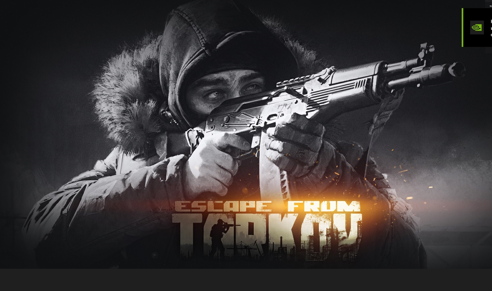

# Инструкция для работы с Markdown

## Выделение текста

Чтобы выделить текст курсивом необходимо обрамить его (*). Например *Вот Так*
Чтобы выделить текст полужирным необходимо обрамить его (**) например **Вот так**

## Списки

 Чтобы добавить ненумерованные списки необходимо пункты выделить (*)
 например вот так:
 * Пункт первый. 
 * Пункт второй.

Или так 
1. 1й Этап
2. 2й Этап   

````sh
Hallo WorlD!
``````
## Работа с изображениями

Чтобы изображение в текст, достаточно написать следующее:


## Ссылки


## Работа с таблицами

## Цитаты

## Заключение

#  Добавим как добавлять картинки в Markdown.

Это Он.

Добавил адову Картинку, которая живёт своей жизнью и регулярно пропадает.


````sh
hallo
``````


Создать папkу, 
* git init   инициализация файла

Вносим изменение в файл и сохраняем
* ctrl + s

затем 

* git add <file> добавить в индекс

затем

* git commit -m "sochranenie"

файл сохранён с комментарием о конкретных действиях которые мы совершили. "Комментарий" прописываем в ковычках.


* git branch <branch_name> создание ветки


* git branch -d text_formating - удаление ветки

* Git branch - показать все ветки

* git checkout <branch_name>   -  переход на указанную ветку.

* git log --graph  показывает коммиты с графикой

* git log --oneline   -  все коммиты в списке


Работая в ветке в которой мы находимся - все изменения касаются только этой ветки. остальные ветки остаются прежними.

*in git bash*

Litva@GoD MINGW64 ~/Desktop/lesson2.0 (master)
* $ git merge newTxt    -    находясь на ветке master прописываем эту команду (GIT MERGE) и ветку которую хотим слить (newTxt) с веткой MASTER (ЧИСТОВИК).


